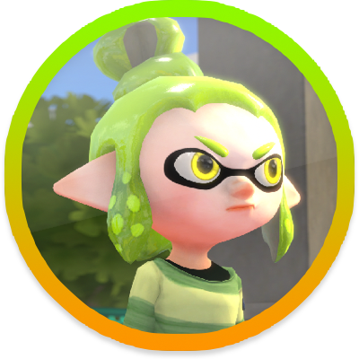

# lime-bot
Hehe a Lime Discordium bot

### Bruh, imagine if this will ever come out...
Yeah, this is hard and I'm not stable so, I'd rather not expect too much 😔👌

### What is this?
- A rushed, basic and made just for fun Discord bot

### What is this supposed to do?
- It should be able to answer to simple and basic questions
- It isn't intended to be a real chatbot, it won't recollect data to improve, it won't learn new answers. JUST FOR FUN MAN I'm not an engineer.

### How could it not be a spammer bot?
-	It should stop when someone is constantly talking to it
	- Stop replaying to them and wait a time (only for that person)
	- Also it should stop if a lot of people is talking to it and go away for a while

### What I wish it could do?
- Do basic moderation
	- Prevent spam
	- Mute users and flag them for manual revision
	- Prevent raiders

### What actually can do?
- Answer to simple and kinda specific questions
- Answer dynamic data like time, date, etc.
- Simulates response and typing times 🥺

### Weird things
- I'll not fix weird responses 🙃
	-	This is pretty common, when you ask something and the bot thinks you asked something completely different.
	- As this bot won't have machine learning this never will be improved.

### Important notes
:warning: If you try to use this code you should know that it won't work directly cause there are files that I'm not uploading like, but questions/answers DB, and obviously, Discord token and that.

Yeah I know, there are already bots for spam prevention and sh*t but I don't care, lemme be a damn nerd in peace.

Also this won't be developed as a software production project so, don't expect the best code 😔✌️

<h3 align="center">
	Okay, but who the f*ck is Lime?
</h3>

  

	She is Lime, also known as K.

<h1></h1>

<h3>Wow, am I really doing this?</h3>

